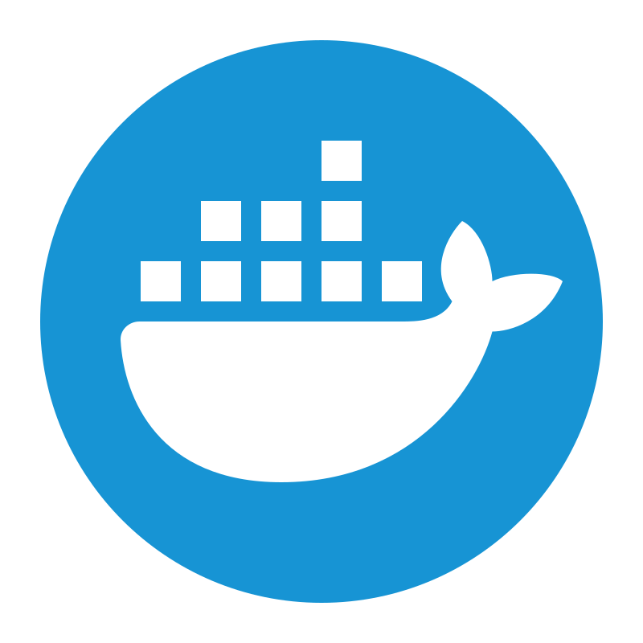

<h1 align="center">Intro</h1>

  <h3 align="center">I have 2 years of software development experience and am in my 4th year at the University of Guelph. I'll be graduating in May 2024 and am currently looking for new grad opportunities!</h3>

  
  
  

 
<h1 align="center">Top Languages & Technologies & Frameworks & Tools</h1>

   
  <code></code>
  <code></code>
  <code></code>
  <code></code>
  <code></code>
  <code></code>
  <code></code>
  <code></code>
  <code></code>
  <code></code>
  <code></code>

  <code></code>
  <code></code>
  <code></code>
  <code></code>
  <code></code>
  <code></code>
  <code></code>
  <code></code>
  <code></code>

 
<h1 align="center">GitHub Stats</h1>

 

